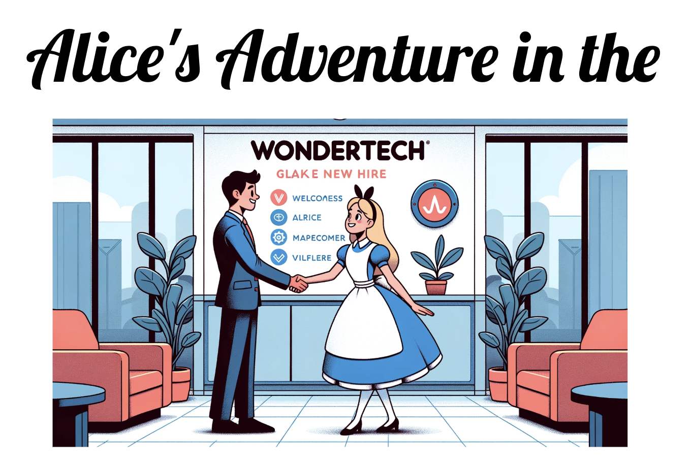

:wave: Welcome to a much longer bio! 

**As a UCSD CSE PhD**. I am a 1st year PhD student at [Dept. Computer Science and Engineering at UC San Diego](https://cse.ucsd.edu/). I am part of the [Sysnet](https://www.sysnet.ucsd.edu/sysnet/) group in UCSD. I am currently under rotation, and had luckily worked with [Yiying Zhang](https://cseweb.ucsd.edu/~yiying/) and [Hao Zhang](https://cseweb.ucsd.edu/~haozhang/) during the past quarters. My research interest currently focus on **LLM system**, particularly serving systems that make modern LLM-backed applications work efficiently and effectively. I am also interested in **database systems** and in particular data analytics systems that enable users to interact with data in a more intuitive and efficient manner.    

**As a Technical Leader in DataChat**. Before joining UCSD, I was a technical leader at [DataChat](https://www.datachat.ai/), a startup company that focuses on building a conversational analytics platform. I was one of the early engineers in the company, and had the opportunity to work on various projects, including the core backend system, the data processing pipeline, the natural langauge system, etc. I was also involved in the design and implementation of the core features of the product, and had the opportunity to work with the product team to understand the user requirements and feedback. I was also involved in the hiring process, and had the opportunity to interview and mentor new engineers and interns. I also led a team of size 5-10 on designing the core backend systems to support DataChat application running on top. _(Paragraph generated by Github Copilot but yes i did all these but can it generate a shorter one... 😐)_

**As a student at UW-Madison**. I got my ~~Ph.D.~~ master [the Computer Sciences at the University of Wisconsin-Madison](https://www.cs.wisc.edu/), advised by [Jignesh Patel](https://pages.cs.wisc.edu/~jignesh/), and was a part of the [UW-Madison Database Group](https://twitter.com/wiscdb?lang=en). My research interests was in the intersection of databases and data analytics systems. I was particularly interested in building systems that enable users to interact with data in a more intuitive and efficient manner. I also got my undergrad degree in Computer Science / Math at the University of Wisconsin-Madison advised by [Remzi Arpaci-Dusseau](https://pages.cs.wisc.edu/~remzi/). I also spent some amazing time side tracking into astronomy ([Ka Ho Yuen](https://www.khyuen.info/)), biochemistry (the [Senes Lab](https://seneslab.biochem.wisc.edu/)), and geoscience ([Yuhao Kang](http://www.kkyyhh96.site/)), where I worked with experts in the field to understand more in different fields of science. I enjoyed my 6 amazing years in Madison, and I am always grateful for the opportunities and experiences that I had there.

<!-- I am also passionate about teaching and mentoring. 
During my years in DataChat, I also mentored 10+ colleagues and interns during work and after, and some of them become successful as leaders in the company or in their own careers. -->

## Active Projects

- **LLM inference and serving systems**. [DistServe](https://hao-ai-lab.github.io/blogs/distserve/) [OSDI 24]
- **Serverless Computing**. 

## Side Projects

### Alice's Adventure in the Wondertech.

I always reflect back on my journey in DataChat after starting my PhD: What have I done right? What are the stuff that I wish I could improve? What inspired me and shaped my core value in my career? What have I missed out? What would I do if I start over again? What did the company do well / need improvement? 

As a result, I decided to write something about my journey in DataChat, and share some thoughts and experiences with people. I wrote this under the name of "Alice", a fictional character who embarks her journey in the Wondertech, a small startup company, and learns about the world of engineering, leadership, and life. It is not meant to be only a reflection of my journey - it is an invitation to everyone who is interested in being successful in a tech company to collectively think about important topics in different stages of their career: the excitement, the frustration, the joy, the sadness, the success, the failure, the growth, the stagnation, the leadership, the teamwork, the innovation, the legacy, the future - all of these are the elements that I hope as an invitation of discussion to include different journeys and experiences under the hood of Alice.

**Progress (2024/3)**: I have organized a preliminary talk, and had presented in some small "meetup" style events. I am currently working on the first draft of the slide deck, which includes 9 chapters and I'm still on chapter 3... The more important thing is to make it interactive - possibly with AI - to engage people in the discussion, and to get feedback from them.